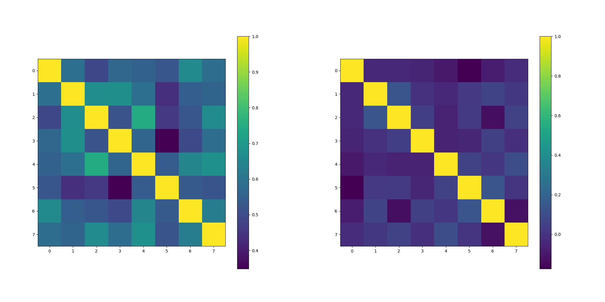

# Embedding Tuning

A library for fine-tuning embedding models using angular margin loss for improved classification performance.

## Features

- Support for multiple OpenCLIP architectures and model sizes.
- Angular margin loss for better feature separation
- Evaluation tools for similarity-based classification
- Support for both seen and unseen class evaluation

## Installation

```bash
# Clone the repository
git clone https://github.com/gimletlabs/embedding-tuning.git
cd embedding-tuning

# Create and activate virtual environment
uv venv --python 3.11
source .venv/bin/activate

# Install dependencies
uv pip install -r requirements.txt

# For NVIDIA Blackwell GPUs, install PyTorch with CUDA 12.8
uv pip install --pre torch torchvision torchaudio --index-url https://download.pytorch.org/whl/nightly/cu128
```

## Quick Start

1. **Prepare Data**

We adopted COCO style datasets. The following script is compatible with torch.vision.datasets.
Experiments in this repo are run on [Flower-102](https://www.robots.ox.ac.uk/~vgg/data/flowers/102/) dataset, which contains 102 species of flowers. Each class in train split contains exactly 10 images.

```bash
python src/embedding_tuning/prepare_data.py \
    --dataset flowers102 \
    --output_dir ./data/flowers102 \
    --holdout_ratio 0.2
```

2. **Fine-tune Model**

```bash
python src/embedding_tuning/train.py \
    --model_type OPEN_CLIP \
    --model_name ViT-B-16 \
    --train_ann <path to training annotations> \
    --validation_ann <path to validation annotations> \
    --experiment_dir <path to experiment dir>
```

3. **Evaluate Zero-Shot classifier**

```bash

catalog_path=<path to zero-shot classifier catalog>
eval_catalog_path=<path to evaluation catalog>
model_type=<model type>
model_name=<model name>
ckpt_path=<path to model checkpoint>
for k in 1 3 10; do

    echo "Evaluating with k=${k}"
    python src/embedding_tuning/eval.py  \
        --catalog_path ${catalog_path} \
        --eval_catalog_path ${eval_catalog_path} \
        --model_type ${model_type} \
        --model_name ${model_name} \
        --model_weight ${ckpt_path} \
        --k ${k}

done
```

## Model Performance

We evaluate models on the Flower-102 dataset using top-1 accuracy metrics across two experiments:

1. Full dataset evaluation: Model finetuning and testing on all 102 flower classes

| Model               | k=1  | k=3  | k=10 |
|---------------------|------|------|------|
| ViT-B-16 (baseline) | 82.0 | 95.5 | 97.8 |
| ViT-B-16-finetuned  | 93.4 | 97.3 | 97.9 |

2. Generalization evaluation: Training on 82 classes and testing separately on public (seen) and holdout (unseen) classes

For classification, we create class prototypes by averaging embeddings from k validation images (k=1,3,10) per class. Test images are classified based on cosine similarity to these prototypes.

### Public Classes (82 Training Classes)

| Model               | k=1  | k=3  | k=10 |
|---------------------|------|------|------|
| ViT-B-16-finetuned  | 93.1 | 96.9 | 97.7 |
| ViT-B-16 (baseline) | 84.9 | 95.4 | 98.1 |

The fine-tuned model shows significant improvement (+8.2%) with a single prototype image (k=1), demonstrating enhanced feature representation for classes seen during training. As k increases, both models achieve similar performance, with the baseline slightly outperforming at k=10.

### Holdout Classes (20 Unseen Classes)

| Model               | k=1  | k=3  | k=10 |
|---------------------|------|------|------|
| ViT-B-16-finetuned  | 73.3 | 84.3 | 89.3 |
| ViT-B-16 (baseline) | 83.4 | 93.9 | 96.9 |

On unseen classes, the baseline model outperforms the fine-tuned model across all k values, with a notable -10.2% difference at k=1. This indicates that fine-tuning, while beneficial for seen classes, compromises the model's generalization capabilities.

It's worth noting that the distribution over class prototypes after applying softmax on the baseline model is less distinct than in the model finetuned with angular margin. Below are the cosine similarities between 8 randomly selected class prototypes before and after large margin finetuning. The results clearly demonstrate how large margin finetuning helps to separate embeddings for different classes, creating more discriminative feature representations.


Key Findings:

- Higher k values consistently improve classification accuracy for both models
- Fine-tuning creates a specialization-generalization trade-off: better performance on training classes but reduced capability on novel classes
- The pre-trained CLIP model maintains superior zero-shot transfer to unseen categories

The limited training data (10 images per class) likely contributes to reduced generalization on unseen classes. Low-rank fine-tuning techniques may be better suited for scenarios with limited training data.
